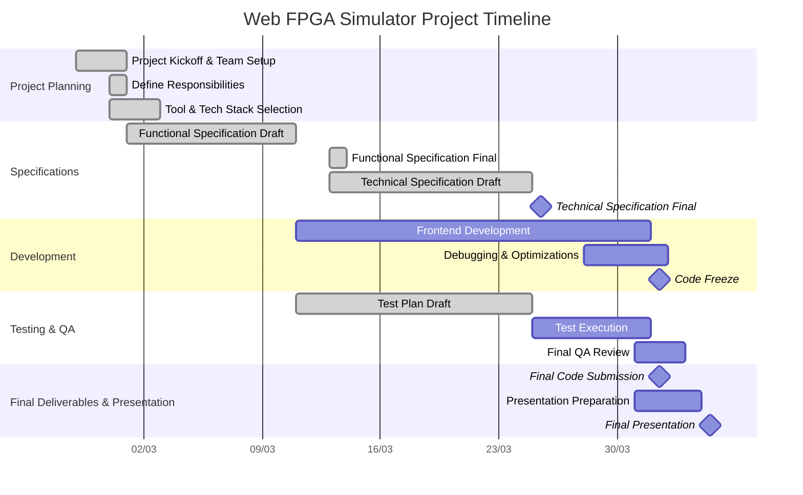

# Project Timeline

---  
**Title:** Web FPGA - Project Timeline

**Team:** Team 7

**Author:** Pierre GORIN

**Version:** 1.0

**Date:** 03/03/2025

---  

 

<h2 id="toc"> Table of Contents</h2>

- [Project Timeline](#project-timeline)
  - [Key Milestones \& Deadlines](#key-milestones--deadlines)
  - [Detailed Project Timeline](#detailed-project-timeline)
  - [Weekly Workload \& Task Assignments](#weekly-workload--task-assignments)
    - [**Week 1 (26/02 - 03/03)** – 10h30 total (3 sessions of 3h30 each)](#week-1-2602---0303--10h30-total-3-sessions-of-3h30-each)
    - [**Week 2 (04/03 - 10/03)** – 7h total (2 sessions of 3h30 each)](#week-2-0403---1003--7h-total-2-sessions-of-3h30-each)
    - [**Week 3 (11/03 - 17/03)** – 17h30 total (5 sessions of 3h30 each)](#week-3-1103---1703--17h30-total-5-sessions-of-3h30-each)
    - [**Week 4 (18/03 - 24/03)** – 3h30 total (1 session of 3h30)](#week-4-1803---2403--3h30-total-1-session-of-3h30)
    - [**Week 5 (25/03 - 31/03)** – 17h30 total (5 sessions of 3h30 each)](#week-5-2503---3103--17h30-total-5-sessions-of-3h30-each)
    - [**Week 6 (01/04 - 07/04)** – 14h total (4 sessions of 3h30 each)](#week-6-0104---0704--14h-total-4-sessions-of-3h30-each)
  - [Estimated Time Allocation per Task](#estimated-time-allocation-per-task)
  - [Summary of Key Deliverables](#summary-of-key-deliverables)

This document outlines the project timeline, including key milestones, deadlines, task assignments, and estimated time allocations.

---

## Key Milestones & Deadlines

| Date            | Milestone                          | Deliverable                   |
| --------------- | ---------------------------------- | ----------------------------- |
| Wednesday 13/03 | Functional Specification completed | `FunctionalSpecifications.md` |
| Monday 25/03    | Technical Specification completed  | `TechnicalSpecifications.md`  |
| Monday 25/03    | Test Plan finalized                | `TestPlan.md`                 |
| Monday 01/04    | Code implementation completed      | Working software              |
| Thursday 04/04  | Final project presentation         | Oral presentation & demo      |

---

## Detailed Project Timeline

---

## Weekly Workload & Task Assignments

### **Week 1 (26/02 - 03/03)** – 10h30 total (3 sessions of 3h30 each)
- Project Setup & Planning
- Assign roles, define responsibilities
- Select tools & technologies
- Start drafting **Functional Specifications**

### **Week 2 (04/03 - 10/03)** – 7h total (2 sessions of 3h30 each)
- Finalize **Functional Specifications** (deadline: 13/03)
- Start drafting **Technical Specifications**
- Define initial **Test Plan**

### **Week 3 (11/03 - 17/03)** – 17h30 total (5 sessions of 3h30 each)
- Start **Backend & Frontend development**
- Continue **Technical Specifications**
- Write **Test Cases**

### **Week 4 (18/03 - 24/03)** – 3h30 total (1 session of 3h30)
- Backend-Frontend Integration starts
- Debugging early issues
- Finalize **Technical Specification & Test Plan** (deadline: 25/03)

### **Week 5 (25/03 - 31/03)** – 17h30 total (5 sessions of 3h30 each)
- Full **integration & optimization**
- Execute **Test Plan & Fix Bugs**
- Conduct **Final QA Review**

### **Week 6 (01/04 - 07/04)** – 14h total (4 sessions of 3h30 each)
- Final Code Submission (01/04)
- Presentation Preparation
- Final Presentation (04/04)

---

## Estimated Time Allocation per Task

| Task                             | Estimated Time (hours) | Assigned To        |
| -------------------------------- | ---------------------- | ------------------ |
| Functional Specification Writing | 10h                    | Aurélien Fernandez |
| Technical Specification Writing  | 15h                    | Abderrazaq Makran  |
| Test Plan & Test Cases Writing   | 10h                    | Guillaume Deramchi |
| Frontend Development             | 30h                    | Antoine Prevost    |
| Debugging & Optimization         | 15h                    | Enzo & Antoine     |
| Final QA Review                  | 5h                     | Guillaume Deramchi |
| User Manual Writing              | 10h                    | Max Bernard        |
| Presentation Slides & Speech     | 8h                     | Pierre Gorin       |

---

## Summary of Key Deliverables

| Deliverable               | Owner                              | Deadline |
| ------------------------- | ---------------------------------- | -------- |
| Functional Specifications | Aurélien Fernandez                 | 13/03    |
| Technical Specifications  | Abderrazaq Makran                  | 25/03    |
| Test Plan & Test Cases    | Guillaume Deramchi                 | 25/03    |
| Frontend Development      | Antoine Prevost et Enzo Guillouche | 01/04    |
| User Manual               | Max Bernard                        | 01/04    |
| Final QA Review           | Guillaume Deramchi                 | 31/03    |
| Presentation Slides       | Pierre Gorin                       | 04/04    |
