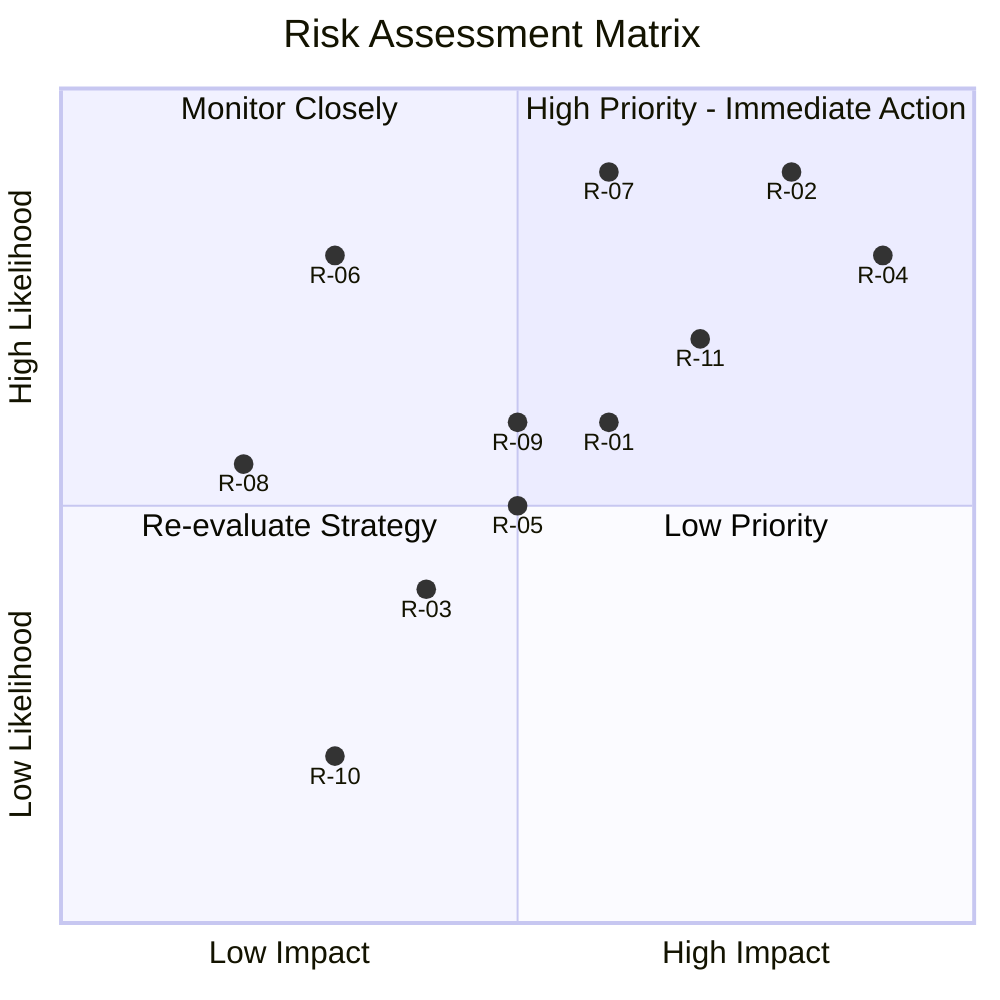

# Risk Management Plan  

---  
**Title:** Web FPGA - Risk Management Plan

**Team:** Team 7

**Author:** Pierre GORIN

**Version:** 1.2

**Date:** 14/03/2025

---  

 

<h2 id="toc"> Table of Contents</h2>

- [Risk Management Plan](#risk-management-plan)
  - [Introduction](#introduction)
  - [Risk Management Process](#risk-management-process)
  - [Risk Identification](#risk-identification)
  - [Risk Assessment](#risk-assessment)
  - [Risk Mitigation Strategies](#risk-mitigation-strategies)
  - [Risk Monitoring and Reporting](#risk-monitoring-and-reporting)
  - [Risk Visualization](#risk-visualization)

---

## Introduction
The **Risk Management Plan** outlines potential risks associated with the **Web FPGA Simulator** project and provides strategies for **identifying, assessing, mitigating, and monitoring** these risks to ensure project success.

## Risk Management Process
The risk management process follows these key steps:
1. **Identify risks** that may impact the project.
2. **Assess the risks** based on likelihood and impact.
3. **Develop mitigation strategies** to reduce or eliminate the risks.
4. **Monitor risks continuously** throughout the project lifecycle.
5. **Report and communicate** risks with the project team.

## Risk Identification
Below are the primary risks identified for this project:

| **Risk ID** | **Risk Description**                                | **Category**      |
| ----------- | --------------------------------------------------- | ----------------- |
| R-01        | Delays in functional and technical specifications   | Scheduling        |
| R-02        | Technical difficulties in integrating FPGA tools    | Technical         |
| R-03        | UI complexity leads to performance issues           | Technical         |
| R-04        | Incomplete testing due to time constraints          | Quality Assurance |
| R-05        | Miscommunication within the team                    | Team Management   |
| R-06        | External dependencies fail                          | External Factors  |
| R-07        | Security vulnerabilities in the web application     | Security          |
| R-08        | Unexpected hardware limitations impact performance  | Hardware          |
| R-09        | Scope creep leads to uncontrolled feature expansion | Project Scope     |
| R-10        | Lack of user engagement and feedback                | User Experience   |
| R-11        | Deployment issues cause delays in final delivery    | Deployment        |

## Risk Assessment
Each identified risk is assessed based on **Likelihood (L)** and **Impact (I)** on a scale of **1 (Low) to 5 (High)**.

| **Risk ID** | **Risk Description**              | **Likelihood (L)** | **Impact (I)** | **Risk Score (L x I)** |
| ----------- | --------------------------------- | ------------------ | -------------- | ---------------------- |
| R-01        | Delays in specifications          | 3                  | 4              | 12 (Medium)            |
| R-02        | FPGA tools integration issues     | 4                  | 5              | 20 (High)              |
| R-03        | UI complexity affects performance | 3                  | 3              | 9 (Medium)             |
| R-04        | Limited time for full testing     | 4                  | 5              | 20 (High)              |
| R-05        | Team miscommunication             | 3                  | 4              | 12 (Medium)            |
| R-06        | Dependency failures               | 2                  | 5              | 10 (Medium)            |
| R-07        | Security vulnerabilities          | 3                  | 5              | 15 (High)              |
| R-08        | Hardware limitations              | 2                  | 4              | 8 (Medium)             |
| R-09        | Scope creep                       | 4                  | 3              | 12 (Medium)            |
| R-10        | Lack of user engagement           | 3                  | 2              | 6 (Low)                |
| R-11        | Deployment issues                 | 4                  | 4              | 16 (High)              |

## Risk Mitigation Strategies
| **Risk ID** | **Mitigation Strategy**                                                    |
| ----------- | -------------------------------------------------------------------------- |
| R-01        | Schedule intermediate reviews to validate progress earlier                 |
| R-02        | Allocate additional time for debugging and integration                     |
| R-03        | Optimize UI performance and focus on core functionalities first            |
| R-04        | Prioritize critical test cases and automate testing where possible         |
| R-05        | Conduct weekly status meetings and encourage proactive communication       |
| R-06        | Identify backup solutions in case external tools fail                      |
| R-07        | Implement security best practices, regular audits, and penetration testing |
| R-08        | Test on different hardware configurations and optimize performance         |
| R-09        | Strict feature control with milestone-based validation                     |
| R-10        | Conduct user testing and actively collect feedback                         |
| R-11        | Establish a robust deployment checklist and contingency plan               |

## Risk Monitoring and Reporting
- **Risk status will be reviewed weekly** in team meetings.
- Any **new risks** identified will be added to this document.
- **High-risk items** will be flagged and addressed **immediately**.

## Risk Visualization
The quadrant below categorizes risks based on **likelihood (y-axis)** and **impact (x-axis)**:

