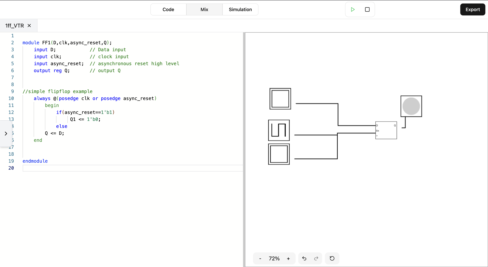

# FPGAlize 👋

     

FPGAlize is a **self-hosted** web platform that provides an **interactive and visual environment** for exploring FPGA signal behavior. 🖥️⚡ It allows users to **observe, analyze, and manipulate** signals in real time, making FPGA development more accessible for learners, researchers, and engineers.

## 🔑 Key Features

- 🎨 **2D Visualization** of BELs and signal routing
- ⚡ **Real-time simulation** with adjustable speed controls
- 📜 **Preloaded Verilog Applications** for educational use
- 👨‍🏫 **Teacher Dashboard** to upload Verilog files and testbenches

<!-- To replace by a GIF -->


## 🚀 Installation

> [!TIP]
> We recommend that you use our public demo by following [this link](https://fpgalize.vercel.app/).

### Prerequisites 🛠️
Ensure you have the following installed:
- **Node.js** v23.7.0 or higher
- **NPM** v11.1.0 or higher

### Install from GitHub 🏗️

1. Clone the repository:
   ```bash
   git clone https://github.com/algosup/2024-2025-project-4-web-fpga-team-7.git
   cd 2024-2025-project-4-web-fpga-team-7
   ```
2. Install dependencies and start the post-build server:
   ```bash
   cd Code/Frontend
   npm install
   npm run build
   npm run preview
   ```
3. Access the application at `http://localhost:4173`.

> [!NOTE]
> You can start the server in Development Mode by running `npm run dev` and access the application at `http://localhost:5173`.

> [!CAUTION]
> The `dev` branch contains the latest unstable features. Use at your own risk.

### Alternative Installation via Scripts ⚙️

**Windows (PowerShell):**
```ps1
cd Scripts
./win-setup.ps1
```

**Linux/macOS:**
```bash
cd Scripts
./unix-setup.sh
```

### 🐳 Quick Start with Docker

1. **Pull and run the container** (no need to build manually):
   ```bash
   docker pull ghcr.io/techxplorerfr/fpgalize:latest
   docker run -p 4173:4173 ghcr.io/techxplorerfr/fpgalize:latest
   ```

2. **Access FPGAlize** at `http://localhost:4173`.

## 🛠️ How to Add Custom Examples

> [!NOTE]
> To add your own example to the application, you need to have access to your post-synthesis files, composed of a [Standard Delay Format File (.sdf)](https://en.wikipedia.org/wiki/Standard_Delay_Format) and [Verilog File (.v)](https://en.wikipedia.org/wiki/Verilog). We highly recommend you using [AMD Vivado Design Suite](https://www.amd.com/fr/products/software/adaptive-socs-and-fpgas/vivado.html) to obtain those files.

To add your custom examples to FPGAlize:

1. Open the left drawer and click **Import**.
2. Drop your files in the corresponding field of the modal which appeared, and then click **Create Example**.


Your example is created and opened as the active tab.

<!-- Add a GIF here -->

## 📚 Documentation
- [Functional Specifications](Documents/FunctionalSpecifications/FunctionalSpecifications.md)
- [Technical Specifications](Documents/TechnicalSpecifications/TechnicalSpecifications.md)
- [Project Charter](Documents/Management/ProjectCharter.md)
- [Test Plan](Documents/QA/TestPlan.md)
- [Test Cases](Documents/QA/TestCases.md)
- [User Manual](Documents/UserManual/UserManual.pdf)

## 📜 License

This project is licensed under the [MIT](./LICENSE.md) License.

## 💬 Support

We welcome your questions and suggestions. Feel free to open an issue in the [Issue Section](https://github.com/algosup/2024-2025-project-4-web-fpga-team-7/issues).

## 👥 Contributing

See the [Contributing Guidelines](./CONTRIBUTING.md) for details on how to contribute.

## ✍️ Authors & Acknowledgments

### Our Team 🚀
| Name                   | Role                | Links                                                                                                                                                                                                                                                                  |
| ---------------------- | ------------------- | ---------------------------------------------------------------------------------------------------------------------------------------------------------------------------------------------------------------------------------------------------------------------- |
| **Pierre GORIN**       | Project Manager     |  [LinkedIn](https://www.linkedin.com/in/pierre-gorin-61a784221/) <br>  [GitHub](https://github.com/Pierre2103)                   |
| **Aurélien FERNANDEZ** | Program Manager     |  [LinkedIn](https://www.linkedin.com/in/aur%C3%A9lien-fernandez-4971201b8/) <br>  [GitHub](https://github.com/aurelienfernandez) |
| **Abderrazaq MAKRAN**  | Technical Lead      |  [LinkedIn](https://www.linkedin.com/in/abderrazaq-makran/) <br>  [GitHub](https://github.com/Amakran2003)                       |
| **Guillaume DERAMCHI** | Quality Assurance   |  [LinkedIn](https://www.linkedin.com/in/guillaume-deramchi/) <br>  [GitHub](https://github.com/Guillaume18100)                   |
| **Enzo GUILLOUCHE**    | Software Engineer 1 |  [LinkedIn](https://www.linkedin.com/in/enzoguillouche/) <br>  [GitHub](https://github.com/EnzoGuillouche)                       |
| **Antoine PREVOST**    | Software Engineer 2 |  [LinkedIn](https://www.linkedin.com/in/antoine-prevost-dev/) <br>  [GitHub](https://github.com/TechXplorerFR)                   |
| **Max BERNARD**        | Technical Writer    |  [LinkedIn](https://www.linkedin.com/in/max-bernard-b77680210/) <br>  [GitHub](https://github.com/maxbernard3)                   |


**Happy coding with FPGAlize!** 🎉
